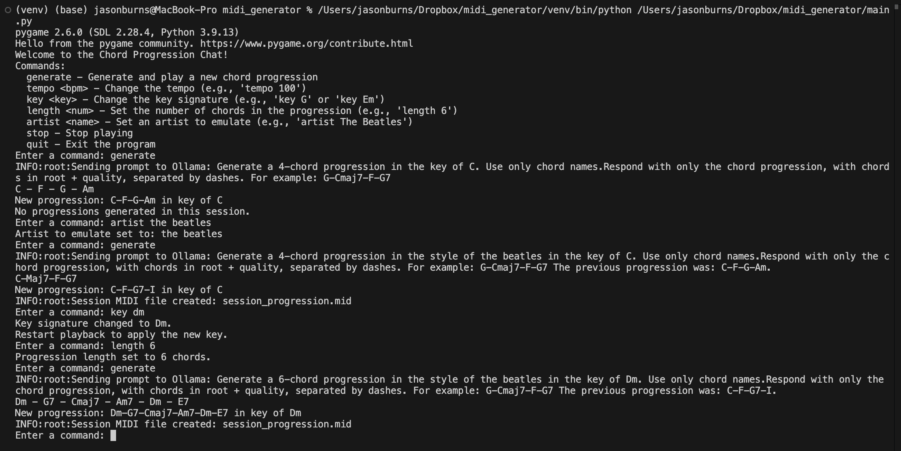

This beginning of a modular AI copilot app.

Features:
- Select key and tempo
- Select artist inspiration
- Select bars per progression
- Select chords per progression
- Voice leading so chords don't jump around too much
- query external ollama for new chord progressions
- Plays looped progression until a new one is requested
- output chords as midi

Planned:
- Output chords to external midi interface
- Output matching clock
- Output 4 midi channels, chord, bass, arpeggiator a, arpeggiator b